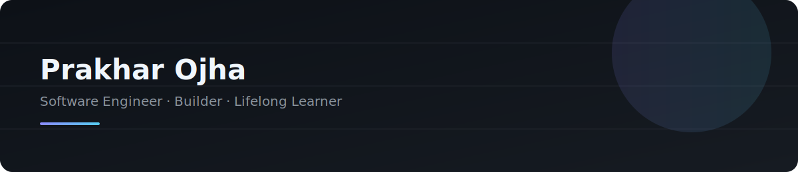

<div align="center">

<!-- ============ HERO BANNER ============ -->


<!-- ============ TYPING HEADER ============ -->
<a href="https://github.com/Prakhar1Ojha">
  
</a>

<br/>

<!-- ============ SOCIAL BADGES ============ -->
<p>
  <a href="https://linkedin.com/in/YOUR_LINKEDIN"></a>
  <a href="mailto:YOUR_EMAIL"></a>
  <a href="https://twitter.com/YOUR_TWITTER"></a>
  <a href="https://YOUR_PORTFOLIO"></a>
  <a href="https://YOUR_RESUME_LINK"></a>
</p>

</div>

<br/>

<!-- ============ PROFESSIONAL INTRODUCTION ============ -->
## ⟁ About Me

I'm **Prakhar Ojha**, a B.Tech CSE student building hands-on with HTML/CSS, React, and Java/DSA — turning what I learn into real projects instead of just tutorials. I care about clean structure, readable code, and design that respects the people using it.

> *"Code is read far more often than it's written — so I write for the reader."*

**Developer Philosophy**
- Simplicity over cleverness
- Ship, measure, iterate
- Strong fundamentals beat trendy frameworks
- Documentation is part of the product

<br/>

## ⟁ Quick Facts

```
const prakharOjha = {
    role: "B.Tech CSE Student",
    location: "Kanpur, India",
    currentFocus: "DSA, full-stack web projects",
    currentlyLearning: "Java + system design fundamentals",
    askMeAbout: ["HTML/CSS", "React", "LeetCode", "Three.js"],
    funFact: "Built a JARVIS-style AI assistant HUD just for fun"
};
```

<br/>

## ⟁ Tech Stack

<a href="https://skillicons.dev">
  
</a>
<br/><br/>

**Languages**


**Frameworks & Libraries**


**Databases & Hosting**


**Tools & Platforms**


<br/>

## ⟁ Featured Projects

<!-- PROJECTS:START -->
<table>
<tr>
<td width="50%">

### [LEETCODE-Solutions](https://github.com/Prakhar1Ojha/LEETCODE-Solutions)
LeetCode solutions in multiple programming languages, featuring clean code, optimized approaches, and algorithmic problem-solving techniques.

`Java` `★ 1`

</td>
<td width="50%">

### [prakhar-portfolio](https://github.com/Prakhar1Ojha/prakhar-portfolio)
A high-performance portfolio showcasing my projects, technical skills, achievements, and passion for software development, AI, and modern web technologies.

`TypeScript`

</td>
</tr>
<tr>
<td width="50%">

### [titanyx-fitness-html](https://github.com/Prakhar1Ojha/titanyx-fitness-html)
Titanyx Fitness Gym — a multi-section HTML5 website demonstrating semantic markup, accessible forms, and structured data tables.

`HTML`

</td>
</tr>
</table>
<!-- PROJECTS:END -->

<sub>This table auto-regenerates from your most-recently-updated public repos via a scheduled GitHub Action — see <code>docs/AUTOMATION.md</code>.</sub>

<br/>

## ⟁ GitHub Analytics

<div align="center">


<br/>


<br/>


<br/>


</div>

<!-- ============ SNAKE ANIMATION (generated by GitHub Action) ============ -->
<div align="center">
  
</div>

<br/>

 ## ⟁ Coding Profiles

<p>
  <a href="https://leetcode.com/u/Prakhar1Ojha"></a>
  <a href="https://codeforces.com/profile/YOUR_CODEFORCES"></a>
  <a href="https://www.codechef.com/users/YOUR_CODECHEF"></a>
  <a href="https://www.hackerrank.com/YOUR_HACKERRANK"></a>
</p>


<br/>

## ⟁ Timeline

```
2026 — Started B.Tech CSE
2026 — Learned HTML/CSS/JS hands-on through real projects
2026 — Java + DSA focus, open-source repo cleanup, exploring Three.js/3D web
```

| Year | Education / Milestone |
|---|---|
| 2026 – 2030 | B.Tech, Computer Science Engineering |
| 2026 | Restructured LEETCODE-Solutions repo with CI/CD via GitHub Actions |

<br/>

## ⟁ Roadmap & Goals

```
LeetCode Problems     ████░░░░░░░░░░░░░░░░░░   40 / 300+   ⏳ In Progress
DSA (Java)            ███████░░░░░░░░░░░░░░░   35%         📚 Ongoing
Full-Stack Projects   █████████████░░░░░░░░░   60%         🚀 Building
System Design Basics  ██░░░░░░░░░░░░░░░░░░░░░   10%         🎯 Starting Soon
Open Source Contrib.  ░░░░░░░░░░░░░░░░░░░░░░░    0%         📚 Upcoming
```

- [ ] Solve 300+ LeetCode problems
- [ ] Ship a full-stack project with auth + database
- [ ] Contribute to an open-source repo outside my own
- [x] Set up CI/CD on a personal repository

<br/>

## ⟁ Let's Connect

<div align="center">


<br/><br/>

<i>Open to collaborations, internships, and interesting problems.</i>
<br/>
Reach out at <b>pojh2737@gmail.com</b>

<br/><br/>


<sub>Thanks for stopping by ✦</sub>
<br/>
<sub><!-- LAST_SYNCED:START -->
 
<!-- LAST_SYNCED:END --></sub>

</div>
